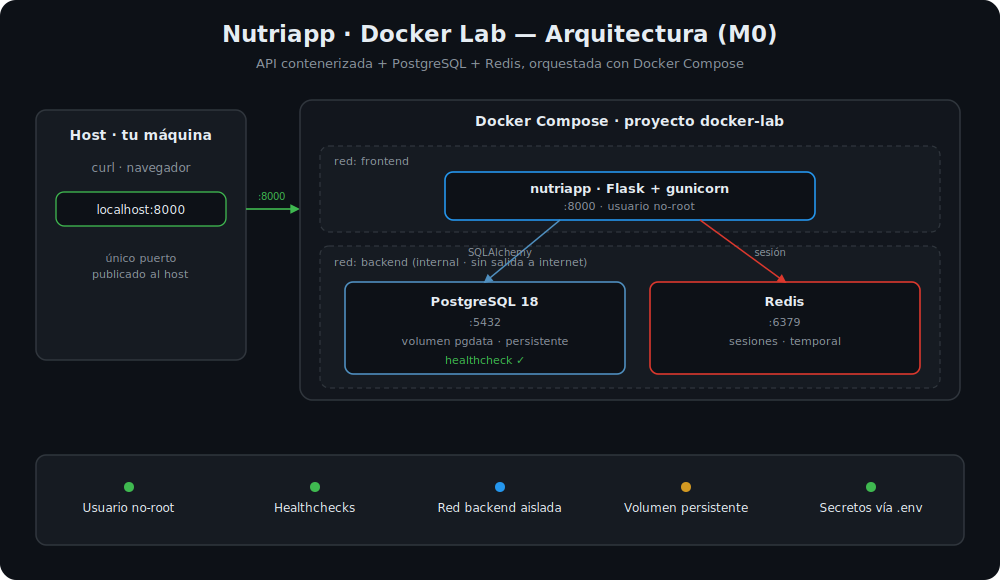

# Docker Lab — Laboratorio de contenedores

[](https://github.com/juanmaescudier/docker-lab/actions/workflows/deploy-nutriapp-image.yml)


Laboratorio de contenedores construido de forma progresiva como proyecto de portfolio para perfiles **Cloud / DevOps Junior**. Empieza siendo un único servicio y evoluciona hasta un sistema multiservicio orquestado, observado y desplegado con CI/CD e IaC. El objetivo no es académico: es **demostrar competencias prácticas** y poder **defender cada decisión técnica** en una entrevista.



> **Estado:** en construcción. Ahora mismo en el módulo **M0 (fundamentos)** — API en contenedores con PostgreSQL, persistencia y acceso vía puerto publicado. El resto del stack (Redis, observabilidad, Kubernetes, IaC en AWS) llega en los módulos siguientes, según el [ROADMAP](ROADMAP.md).

---

## Por qué este proyecto

Ya tengo un laboratorio previo de Linux + AWS con máquinas virtuales (bastión, web, base de datos, monitorización con Prometheus/Grafana, backups 3-2-1 a S3 y CI/CD con GitHub Actions). Con este lab quiero dar el siguiente paso: pasar del paradigma de VMs al de **contenedores y orquestación**, que es justo el recorrido que hace un DevOps en la vida real.

No es una re-implementación de aquel laboratorio en Docker. Es un proyecto nuevo, diseñado desde cero, para aprender el ecosistema de contenedores con criterio y no a base de copiar tutoriales.

---

## Qué quiero demostrar

- **Docker sólido:** Dockerfiles limpios (multi-stage, imágenes ligeras, usuario no-root), Compose bien estructurado, redes y volúmenes con criterio.
- **Seguridad de contenedores:** escaneo de vulnerabilidades, imágenes mínimas y gestión de secretos fuera del código.
- **CI/CD de imágenes:** pipelines que construyen, escanean y publican imágenes automáticamente.
- **Observabilidad:** métricas y dashboards de los contenedores con Prometheus y Grafana.
- **Orquestación:** migración de Docker Compose a Kubernetes en un clúster local.

---

## La aplicación

El núcleo es una **API en Python (Flask)** con una **base de datos (PostgreSQL)** y una **cache (Redis)**. Arranca como un servicio único y, más adelante, la parto en varios servicios (API + worker + cola) para que la orquestación tenga sentido real.

Elegí Flask a propósito: el foco de este laboratorio son los **contenedores**, no la aplicación. Mantengo la app simple para poder concentrarme en la infraestructura.

---

## Cómo evoluciona el sistema

El proyecto crece en tres estados, y cada uno es funcional por sí mismo:

1. **Servicio único contenerizado** — API + BD + cache con Docker Compose.
2. **Multiservicio + CI/CD + observabilidad** — la app se parte en varios servicios, con pipeline de imágenes y monitorización.
3. **Orquestado en Kubernetes** — todo el sistema corriendo en un clúster local, con escalado.

El detalle completo, con las decisiones técnicas justificadas y los criterios de "hecho" de cada módulo, está en el [ROADMAP](ROADMAP.md).

---

## Stack

| Área | Tecnología |
|------|------------|
| Aplicación | Python / Flask |
| Base de datos | PostgreSQL |
| Cache / cola | Redis |
| Orquestación local | Docker Compose → Kubernetes (k3d/kind) |
| Registry | GitHub Container Registry (GHCR) |
| CI/CD | GitHub Actions |
| Seguridad | Trivy / docker scout |
| Observabilidad | Prometheus + Grafana + cAdvisor + node-exporter |

---

## Estructura del repositorio

```
docker-lab/
├── README.md          # Este archivo
├── ROADMAP.md         # Diseño y plan por módulos
├── LICENSE
├── compose.yaml       # Orquesta el stack (api + Postgres)
├── .env.example       # Plantilla de variables de entorno
├── docs/              # Decisiones de arquitectura (ADR)
├── services/
│   └── api/           # Servicio Flask: Dockerfile + código de la app
└── infra/             # Observabilidad, Kubernetes e IaC (más adelante)
```

> La estructura crece módulo a módulo. Las decisiones importantes quedan registradas como ADR en `docs/`.

---

## Cómo levantarlo

Requisitos: Docker y Docker Compose.

```bash
git clone https://github.com/juanmaescudier/docker-lab.git
cd docker-lab

# Copiar la plantilla de variables y ajustar los valores
cp .env.example .env

# Construir y levantar el stack (API + PostgreSQL + Redis)
docker compose up --build
```

La API queda disponible en `http://localhost:8000`. Flujo de usuarios y sesión:

```bash
# Registro (email y password obligatorios)
curl -X POST http://localhost:8000/users \
  -H "Content-Type: application/json" \
  -d '{"email":"demo@example.com","password":"1234","name":"Demo"}'

# Login: guarda la cookie de sesión (httpOnly) en cookies.txt
curl -c cookies.txt -X POST http://localhost:8000/login \
  -H "Content-Type: application/json" \
  -d '{"email":"demo@example.com","password":"1234"}'

# Quién soy: envía la cookie de sesión
curl -b cookies.txt http://localhost:8000/me

# Cerrar sesión
curl -b cookies.txt -X POST http://localhost:8000/logout
```

Los datos persisten en un volumen de Docker: `docker compose down` y un nuevo `up` los conservan; `docker compose down -v` los elimina. Las sesiones viven en Redis y son efímeras.

> Estado actual: **M0 y M1 completados** — API contenerizada con PostgreSQL, sesiones en Redis y autenticación (M0), e imagen endurecida y escaneada con Trivy (M1). El resto del stack (CI/CD, observabilidad, Kubernetes, IaC en AWS) llega en los módulos siguientes, según el [ROADMAP](ROADMAP.md).

---

## Roadmap

Consulta el plan completo y el estado de cada módulo en **[ROADMAP.md](ROADMAP.md)**.

---

## Autor

Juanma — [github.com/juanmaescudier](https://github.com/juanmaescudier)
