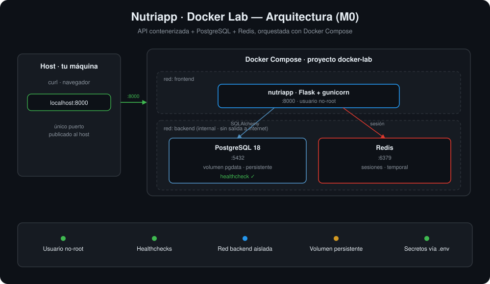
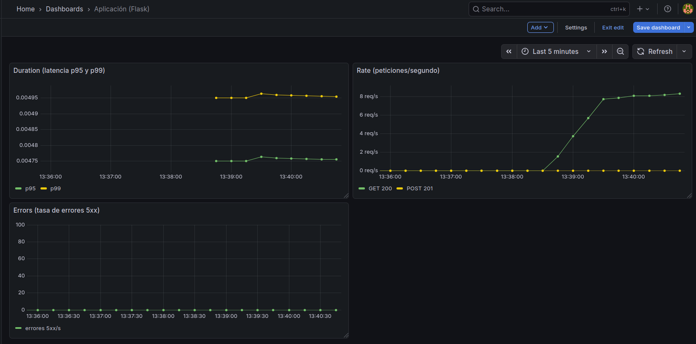
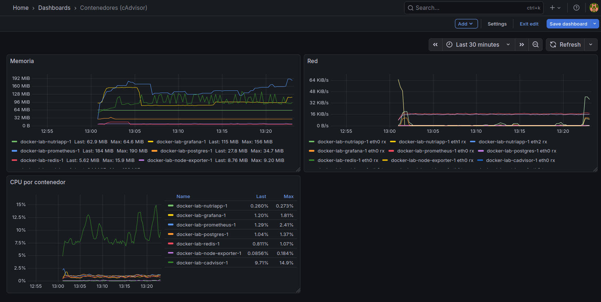
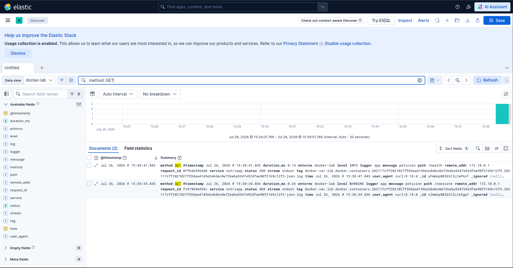

# Docker Lab — Laboratorio de contenedores

[](https://github.com/juanmaescudier/docker-lab/actions/workflows/publish-nutriapp-image.yml)


Laboratorio de contenedores construido de forma progresiva como proyecto de portfolio para perfiles **Cloud / DevOps Junior**. Empieza siendo un único servicio y evoluciona hasta un sistema multiservicio orquestado, observado y desplegado con CI/CD e IaC. El objetivo no es académico: es **demostrar competencias prácticas** y poder **defender cada decisión técnica** en una entrevista.



> **Estado:** en construcción. **M0–M3 completados** — API en contenedores con PostgreSQL y sesiones en Redis (M0), imagen endurecida y escaneada con Trivy (M1), CI/CD de imágenes con GitHub Actions y GHCR (M2), y observabilidad completa con sus dos pilares: **métricas** (Prometheus + Grafana, en tres capas) y **logs** (Elasticsearch + Kibana + Fluent Bit) (M3). Lo siguiente, según el [ROADMAP](ROADMAP.md): multiservicio, Kubernetes e IaC en AWS.

---

## Contenido

- [Por qué este proyecto](#por-qué-este-proyecto)
- [Qué quiero demostrar](#qué-quiero-demostrar)
- [La aplicación](#la-aplicación)
- [Cómo evoluciona el sistema](#cómo-evoluciona-el-sistema)
- [Stack](#stack)
- [Estructura del repositorio](#estructura-del-repositorio)
- [Cómo levantarlo](#cómo-levantarlo) — detalle en la [guía de uso](docs/uso.md)
- [Observabilidad](#observabilidad)
- [Roadmap](#roadmap) — plan completo en [ROADMAP.md](ROADMAP.md)
- [Decisiones de arquitectura (ADR)](#decisiones-de-arquitectura-adr)

---

## Por qué este proyecto

Ya tengo un laboratorio previo de Linux + AWS con máquinas virtuales (bastión, web, base de datos, monitorización con Prometheus/Grafana, backups 3-2-1 a S3 y CI/CD con GitHub Actions). Con este lab quiero dar el siguiente paso: pasar del paradigma de VMs al de **contenedores y orquestación**, que es justo el recorrido que hace un DevOps en la vida real.

No es una re-implementación de aquel laboratorio en Docker. Es un proyecto nuevo, diseñado desde cero, para aprender el ecosistema de contenedores con criterio y no a base de copiar tutoriales.

---

## Qué quiero demostrar

- **Docker sólido:** Dockerfiles limpios (multi-stage, imágenes ligeras, usuario no-root), Compose bien estructurado, redes y volúmenes con criterio.
- **Seguridad de contenedores:** escaneo de vulnerabilidades, imágenes mínimas y gestión de secretos fuera del código.
- **CI/CD de imágenes:** pipelines que construyen, escanean y publican imágenes automáticamente.
- **Observabilidad:** métricas y dashboards de los contenedores con Prometheus y Grafana.
- **Orquestación:** migración de Docker Compose a Kubernetes en un clúster local.

---

## La aplicación

El núcleo es una **API en Python (Flask)** con una **base de datos (PostgreSQL)** y una **cache (Redis)**. Arranca como un servicio único y, más adelante, la parto en varios servicios (API + worker + cola) para que la orquestación tenga sentido real.

Elegí Flask a propósito: el foco de este laboratorio son los **contenedores**, no la aplicación. Mantengo la app simple para poder concentrarme en la infraestructura.

---

## Cómo evoluciona el sistema

El proyecto crece en tres estados, y cada uno es funcional por sí mismo:

1. **Servicio único contenerizado** — API + BD + cache con Docker Compose.
2. **Multiservicio + CI/CD + observabilidad** — la app se parte en varios servicios, con pipeline de imágenes y monitorización.
3. **Orquestado en Kubernetes** — todo el sistema corriendo en un clúster local, con escalado.

El detalle completo, con las decisiones técnicas justificadas y los criterios de "hecho" de cada módulo, está en el [ROADMAP](ROADMAP.md).

---

## Stack

| Área | Tecnología |
|------|------------|
| Aplicación | Python / Flask |
| Base de datos | PostgreSQL |
| Cache / cola | Redis |
| Orquestación local | Docker Compose → Kubernetes (k3d/kind) |
| Registry | GitHub Container Registry (GHCR) |
| CI/CD | GitHub Actions |
| Seguridad | Trivy / docker scout |
| Observabilidad (métricas) | Prometheus + Grafana + cAdvisor + node-exporter |
| Observabilidad (logs) | Elasticsearch + Kibana + Fluent Bit |

---

## Estructura del repositorio

```
docker-lab/
├── README.md                     # Este archivo
├── ROADMAP.md                    # Diseño y plan por módulos
├── LICENSE
├── compose.yaml                  # Stack base: API + Postgres + Redis
├── compose.observability.yaml    # Métricas: Prometheus, Grafana, cAdvisor, node-exporter
├── compose.logging.yaml          # Logs: Elasticsearch, Kibana, Fluent Bit
├── .env.example                  # Plantilla de variables de entorno
├── .github/workflows/            # CI: build → escaneo con Trivy → push a GHCR
├── docs/
│   ├── adr/                      # Decisiones de arquitectura (ADR)
│   └── img/                      # Diagramas y capturas
├── services/
│   └── api/                      # Servicio Flask: Dockerfile + código de la app
└── infra/
    ├── prometheus/               # Configuración de scrape
    ├── grafana/                  # Datasource y dashboards como código
    └── fluent-bit/               # Pipeline de logs
```

> La estructura crece módulo a módulo. Las decisiones importantes quedan registradas como ADR en `docs/`.

---

## Cómo levantarlo

Requisitos: Docker y Docker Compose.

```bash
git clone https://github.com/juanmaescudier/docker-lab.git
cd docker-lab

cp .env.example .env          # copiar la plantilla de variables y ajustar valores
docker compose up --build     # API + PostgreSQL + Redis
```

La API queda en `http://localhost:8000`. La observabilidad es **opcional** y se añade combinando ficheros Compose:

```bash
# todo: app + métricas + logs
docker compose -f compose.yaml -f compose.observability.yaml -f compose.logging.yaml up -d --build
```

Grafana en `:3000` (dashboards ya provisionados) y Kibana en `:5601`.

> ⚠️ Las **métricas por contenedor** (cAdvisor) y la **recolección de logs** (Fluent Bit) requieren Docker sobre **Linux nativo**: en Docker Desktop (Windows/WSL2 y macOS) arrancan sin errores pero no recogen datos, porque el daemon corre aislado en su propia VM. Yo desarrollo en Windows y valido la observabilidad en una VM Ubuntu.

📖 **[Guía de uso completa](docs/uso.md)** — probar la API paso a paso, arrancar cada stack por separado, puertos y accesos, consultas KQL en Kibana, limitaciones por entorno y notas de recursos.

> Estado actual: **M0–M3 completados** — API contenerizada con PostgreSQL, sesiones en Redis y autenticación (M0), imagen endurecida y escaneada con Trivy (M1), CI/CD de imágenes con GitHub Actions y GHCR (M2) y observabilidad completa: métricas con Prometheus + Grafana y logs con Elasticsearch + Kibana + Fluent Bit, con dashboards como código (M3). El resto (multiservicio, Kubernetes, IaC en AWS) llega después, según el [ROADMAP](ROADMAP.md).

---

## Observabilidad

El stack se monitoriza en tres capas —host, contenedor y aplicación— con **Prometheus** (métricas) y **Grafana** (dashboards), todo provisionado como código (ver [ADR-0006](docs/adr/0006-observabilidad-prometheus-grafana.md)).

**Métricas de la aplicación** (Flask), siguiendo el método **RED** —Rate, Errors, Duration—. Construí los paneles a mano con PromQL:



**Métricas por contenedor** con cAdvisor (CPU, memoria y red de cada servicio), también con paneles propios:



Para la capa de host uso el dashboard *Node Exporter Full* (importado de la comunidad, ID 1860) sobre las métricas de `node-exporter`.

### Logs centralizados

El segundo pilar. Los logs de todos los contenedores van a **Elasticsearch** y se consultan desde **Kibana**, recolectados por **Fluent Bit** (ver [ADR-0007](docs/adr/0007-logs-elastic-stack.md)):

```
Contenedores (stdout) → Fluent Bit (tail) → Elasticsearch (un índice/día) → Kibana
```

La API emite **logs estructurados en JSON**: cada petición genera un registro con `service`, `level`, `method`, `path`, `status`, `duration_ms` y un `request_id` que permite rastrear una petición concreta. Eso convierte los logs en datos consultables:

```
service: nutriapp and status >= 400
duration_ms > 100
level: ERROR
```



---

## Roadmap

Consulta el plan completo y el estado de cada módulo en **[ROADMAP.md](ROADMAP.md)**.

---

## Decisiones de arquitectura (ADR)

Cada decisión técnica relevante queda registrada con su contexto, las alternativas que descarté y las consecuencias que acepto. Es la parte del repo que mejor explica *por qué* está construido así:

| ADR | Decisión |
|---|---|
| [0001](docs/adr/0001-arquitectura-y-alcance-inicial.md) | Arquitectura y alcance inicial |
| [0002](docs/adr/0002-punto-de-montaje-postgres.md) | Punto de montaje del volumen de PostgreSQL |
| [0003](docs/adr/0003-autenticacion-por-sesion.md) | Autenticación por sesión sobre Redis |
| [0004](docs/adr/0004-seguridad-de-la-imagen.md) | Seguridad de la imagen (y por qué volví de distroless a slim) |
| [0005](docs/adr/0005-cicd-imagenes-github-actions.md) | CI/CD de imágenes con GitHub Actions y GHCR |
| [0006](docs/adr/0006-observabilidad-prometheus-grafana.md) | Observabilidad con Prometheus + Grafana (host, contenedor y app) |
| [0007](docs/adr/0007-logs-elastic-stack.md) | Centralización de logs con el Elastic Stack |

---

## Autor

Juanma — [github.com/juanmaescudier](https://github.com/juanmaescudier)
