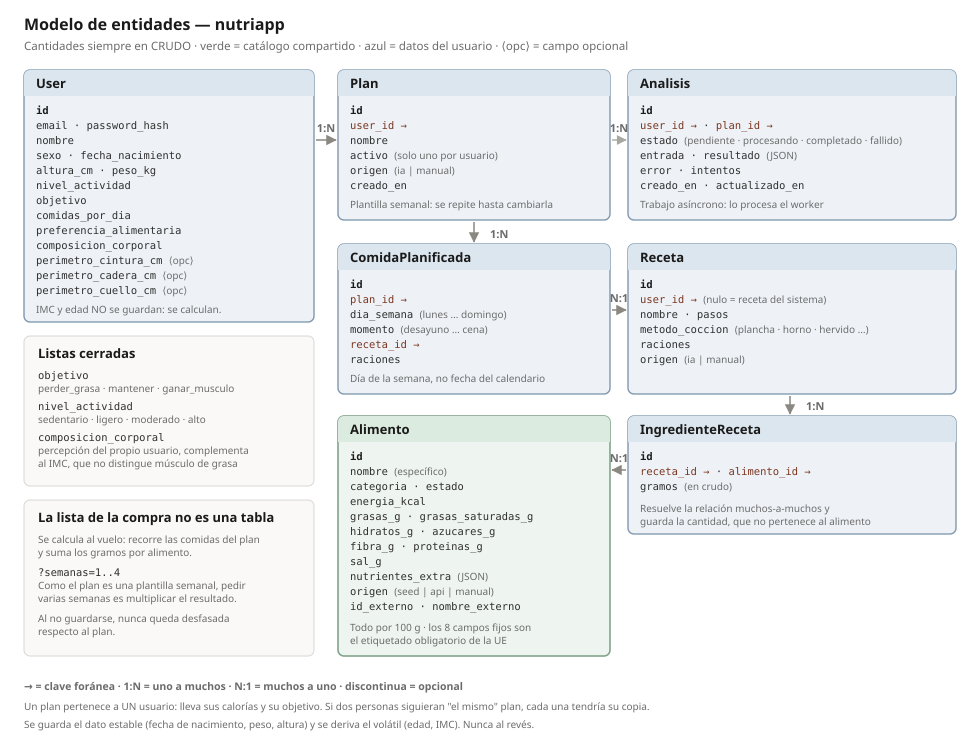

# Diseño del dominio — nutriapp

Documento de diseño de la aplicación del laboratorio. Recoge qué hace, cómo está
modelada y por qué tomé cada decisión. El código viene después de esto, no antes.

---

## 1. Qué hace la aplicación

Un asistente de nutrición que planifica comidas y genera la lista de la compra.
El recorrido completo:

1. Me registro y doy mis datos físicos y mi **objetivo** (de una lista cerrada).
2. Pido un **plan semanal**. La IA lo compone: crea recetas y las reparte por los
   días y momentos de la semana.
3. Puedo **editarlo todo a mano**: crear mis propias recetas y planes sin IA.
4. Genero la **lista de la compra**, indicando para cuántas semanas la quiero.
5. Pido un **análisis** del plan contra mi objetivo.

Los pasos 2 y 5 son lentos (hablan con un modelo de lenguaje), así que van por
cola y los procesa un worker. El resto son operaciones inmediatas de la API.

**Alcance deliberado:** esto es el laboratorio, no el producto. Cada pieza existe
y hace algo real —para que las métricas, los logs, el escalado y el CI/CD tengan
sentido— pero con la lógica de negocio mínima. Si una funcionalidad no aporta
aprendizaje de infraestructura, se queda fuera o es un *stub*.

---

## 2. Las entidades

| Entidad | Qué representa |
|---|---|
| `User` | Quién soy: datos físicos, objetivo y preferencias |
| `Alimento` | Un alimento concreto con sus valores nutricionales por 100 g |
| `Receta` | Un plato, con sus pasos y método de cocción |
| `IngredienteReceta` | Cuántos gramos de un alimento lleva una receta |
| `Plan` | Una plantilla semanal de comidas de un usuario |
| `ComidaPlanificada` | Una receta en un día de la semana y momento concretos |
| `Analisis` | Un trabajo asíncrono y su resultado |

La lista de la compra **no es una entidad**: se calcula.

---

## 3. Decisiones de diseño

### 3.1 El plan es una plantilla semanal, no un rango de fechas

Así es como funciona una pauta de nutricionista en la vida real: te dan una semana
tipo y la repites hasta que te la cambian.

**Decisión:** `Plan` no tiene fecha de fin. Tiene un campo `activo`, y solo puede
haber un plan activo por usuario. `ComidaPlanificada` guarda `dia_semana`
(`lunes`…`domingo`), no una fecha del calendario.

**Consecuencias:** los planes anteriores quedan archivados como histórico de
pautas, igual que guardarías las dietas antiguas. Y la lista de la compra se
vuelve natural: es lo que necesito para una semana de esa plantilla.

**Nota de futuro:** registrar **lo que realmente comí** sería otra entidad
distinta, esa sí con fechas reales. El plan es lo previsto; el registro sería lo
ocurrido. Fuera del alcance actual.

### 3.2 Las cantidades siempre en crudo

Un alimento cambia mucho al cocinarse: 100 g de arroz crudo no son 100 g de arroz
cocido, porque absorbe agua. Mezclar ambos estados daría cálculos erróneos.

**Decisión:** las recetas expresan sus cantidades **en crudo**, y el método de
cocción se guarda aparte como información para quien cocina.

**Por qué:** es como se escriben las recetas y como se compra en el supermercado,
lo que hace que la lista de la compra sea directa (200 g de arroz en el plan =
200 g que compro). La alternativa —expresarlo en cocinado, que es como pesa la
comida quien hace seguimiento— obligaría a factores de conversión por alimento y
por método de cocción.

**Consecuencia:** la interfaz debe decir **explícitamente** que las cantidades son
en crudo, en cada pantalla donde aparezcan. No puede quedar implícito.

### 3.3 El catálogo guarda alimentos específicos, no conceptos

"Pollo" no es un alimento con valores nutricionales: la pechuga cruda, el muslo
con piel y el pollo asado son distintos. Si el catálogo tuviera una única fila
`pollo`, mentiría en casi todas las recetas.

**Decisión:** cada fila de `Alimento` es un alimento **específico y medible**
("pechuga de pollo, cruda"), y la columna `categoria` agrupa las variantes.

**Consecuencia:** "pollo" pasa a ser un **criterio de búsqueda**, no un registro.
Tanto el usuario como la IA ven las variantes disponibles con sus valores y eligen
la que corresponde a esa receta.

### 3.4 La cantidad vive en la relación, no en el alimento

`Alimento` guarda los valores **por 100 g**, que son fijos y universales. Los 200 g
de pollo de una receta concreta pertenecen a esa receta.

Como una receta lleva varios alimentos y un alimento aparece en varias recetas, es
una relación **muchos a muchos**; y como además lleva un dato propio (los gramos),
no basta con una tabla de unión: es una entidad, `IngredienteReceta`.

**Por qué importa:** los valores del pollo se guardan una sola vez. Si mañana los
corrijo, toco una fila y todas las recetas quedan corregidas. Si los hubiera
copiado dentro de cada receta, tendría que actualizar miles de filas y acabarían
divergiendo entre sí.

**Sobre el tamaño:** `IngredienteReceta` crece con las recetas, pero cada fila son
dos enteros y un decimal. Mil recetas de seis ingredientes son seis mil filas.
`Alimento`, en cambio, se mantiene acotado: los alimentos del mundo son finitos.

### 3.5 Guardar el dato estable, derivar el volátil

Ni la **edad** ni el **IMC** se guardan en la base de datos.

- La edad se calcula desde `fecha_nacimiento`. Guardar `edad = 34` sería falso
  dentro de un año y nadie lo actualizaría.
- El IMC se calcula desde `peso_kg` y `altura_cm`. Guardarlo quedaría desfasado en
  cuanto cambiara el peso.

Es la misma regla en ambos casos: **se persiste el hecho que no cambia y se deriva
el resto**. Guardar un valor derivado es garantizarse una incoherencia futura.

**Sobre el IMC:** es orientativo y no distingue músculo de grasa. Por eso el
modelo incluye también `composicion_corporal` (la percepción del propio usuario) y
perímetros opcionales de cintura, cadera y cuello, que aportan contexto que el IMC
por sí solo no da.

### 3.6 La lista de la compra se calcula, y admite varias semanas

**Decisión:** `GET /planes/<id>/lista-compra?semanas=N` recorre las comidas del
plan, suma los gramos por alimento y multiplica por el número de semanas.

**Por qué no se guarda:** no hay tabla que mantener y la lista **nunca queda
desfasada** respecto al plan. Si la guardara y luego cambiara una comida, tendría
dos versiones de la verdad y habría que decidir cuál manda.

**Por qué el multiplicador es trivial:** como el plan es una plantilla semanal fija,
comprar para tres semanas es exactamente tres veces lo mismo.

**Lo que acepto a cambio:** no se pueden marcar artículos como comprados ni editar
la lista. Para el laboratorio sobra; en un producto real habría que persistirla.

**Nota de futuro:** esta lógica está pensada para **extraerse a su propio
microservicio** más adelante, como ejercicio deliberado de separar un servicio y
comunicar servicios entre sí. Por eso vive aislada.

### 3.7 Listas cerradas en vez de texto libre

`objetivo`, `nivel_actividad`, `composicion_corporal`, `preferencia_alimentaria`,
`dia_semana`, `momento` y `estado` toman valores de un conjunto fijo.

**Por qué:** la interfaz muestra un desplegable, la base de datos no se llena de
variantes del mismo concepto ("adelgazar", "bajar peso", "perder grasa"), y sobre
todo la IA recibe y devuelve **valores predecibles** en lugar de texto libre que
habría que interpretar.

### 3.8 Qué valores nutricionales guarda el catálogo

**Decisión:** ocho columnas fijas, que son exactamente la **declaración
nutricional obligatoria de la Unión Europea** —lo que aparece en cualquier envase
del supermercado—, y una columna JSON para todo lo demás.

| Campo | |
|---|---|
| `energia_kcal` | |
| `grasas_g` · `grasas_saturadas_g` | *"de las cuales saturadas"* |
| `hidratos_g` · `azucares_g` | *"de los cuales azúcares"* |
| `fibra_g` | |
| `proteinas_g` | |
| `sal_g` | |
| `nutrientes_extra` | JSON: vitaminas, minerales, colesterol… |

**Por qué esos ocho:** porque el criterio no es una opinión mía sino un estándar
legal, y eso lo hace defendible. USDA ofrece cientos de nutrientes; quedarse con
los del etiquetado acota la tabla sin perder nada relevante para planificar dietas.

**Por qué el JSON para el resto:** columnas fijas para lo que se consulta, filtra y
suma; JSON para la cola larga que solo se muestra. Evita una tabla de doscientas
columnas casi vacías sin tirar datos que la API ya da.

### 3.9 La IA compone; el catálogo aporta los números

Un modelo de lenguaje es bueno decidiendo qué pega con qué y cómo repartir las
comidas de la semana. Es malo dando cifras exactas: si le pregunto las calorías
del pollo, dará un número plausible que puede variar entre respuestas.

**Decisión:** la IA recibe el catálogo y **solo puede elegir de él**. Los valores
nutricionales salen siempre de la tabla, nunca del modelo.

Esto se llama **anclar** (*grounding*) el modelo en datos verificados. Tiene dos
ventajas: los números son correctos y trazables, y la tarea del modelo se vuelve
mucho más fácil —elegir identificadores de una lista en lugar de recordar datos
nutricionales—, lo que permite usar modelos más pequeños.

**No hace falta entrenar nada.** Entrenar (o hacer *fine-tuning*) es ajustar los
pesos del modelo con datos propios: caro, con GPU y conjuntos de datos grandes, y
sirve para cambiar su comportamiento, no para darle información. Aquí basta con
instrucciones en el *prompt* y el catálogo como contexto.

### 3.10 Origen de los datos nutricionales: USDA + semilla propia

**Decisión:** una tabla `Alimento` propia que es la fuente de la verdad, sembrada
con 30-50 alimentos básicos versionados en el repo, y ampliable bajo demanda
consultando la API de **USDA FoodData Central**.

**Por qué USDA y no Open Food Facts:**

| | USDA FoodData Central | Open Food Facts |
|---|---|---|
| Tipo de dato | Alimentos **genéricos** | Productos de supermercado con código de barras |
| Licencia | CC0, dominio público | ODbL: atribución y *share-alike* |
| Clave | Requiere clave gratuita | Sin clave |

Para recetas hacen falta alimentos genéricos, no marcas concretas. Y la licencia
ODbL de Open Food Facts obliga a publicar como datos abiertos cualquier base
derivada, lo que es una atadura real si esto llegara a ser un producto.

Que USDA pida una clave **no es un inconveniente en este laboratorio**: es un
secreto que gestionar, y eso conecta con la gestión de secretos del M1, con los
`Secret` de Kubernetes y con Terraform.

**El pero:** los nombres de USDA están en inglés y con nomenclatura de laboratorio
("Chicken, broilers or fryers, breast, meat only, raw"). Se resuelve guardando en
`Alimento` tanto el `nombre` en español —que es lo que ven el usuario y la IA—
como el `nombre_externo` y el `id_externo`. Todo el sistema habla español; el
inglés solo aparece al importar un alimento nuevo, y esa importación ocurre **una
vez por alimento**, no una vez por receta.

**Para lo que no existe todavía:** cuando la IA propone un alimento que no está en
el catálogo, el worker lo busca en USDA y, si hace falta, usa el propio modelo
para desambiguar entre los resultados. Como ocurre dentro del worker, que ya es
asíncrono, no añade latencia visible.

### 3.11 El modelo no se parece a la API externa

**Decisión:** la correspondencia entre los campos de USDA y los del catálogo vive
en **un único módulo traductor**, no repartida por el código.

**Por qué:** si modelara la tabla a imagen de su API, cualquier cambio suyo se me
filtraría por toda la aplicación. Con un traductor, un cambio de formato se
resuelve en un fichero. Y si algún día quisiera añadir Open Food Facts como
segunda fuente, sería escribir otro traductor sin tocar el modelo.

> **Pendiente:** los identificadores y nombres exactos de los nutrientes de USDA
> hay que sacarlos de su documentación al implementar el traductor. No están
> decididos en este documento.

### 3.12 Cómo se protege el catálogo

`Alimento.origen` toma tres valores:

| Origen | Significado | ¿Lo sobrescribe la API? |
|---|---|---|
| `seed` | Vino del fichero de semilla del repo | No |
| `api` | Importado de USDA | Sí |
| `manual` | Lo he creado o editado yo | No |

Al editar un alimento pasa a ser `manual`, así que **queda protegido por el mero
hecho de haberlo tocado**. No hace falta revisar el catálogo alimento por alimento:
solo se corrige lo que chirría, y corregirlo ya lo blinda.

### 3.13 Por qué existe la semilla

Los datos de semilla se cargan al desplegar si la tabla está vacía. Con ellos, un
`docker compose up` desde cero deja la aplicación **funcionando sin depender de
USDA ni de internet**, y las demostraciones salen siempre iguales.

---

## 4. Endpoints

| Método | Ruta | Qué hace | Códigos |
|---|---|---|---|
| POST | `/users` | Registro | 201 · 400 · 409 |
| POST | `/login` · `/logout` | Sesión | 200 · 401 |
| GET | `/me` | Mis datos, con edad e IMC calculados | 200 · 401 |
| PATCH · DELETE | `/users/<id>` | Editar o borrar mi usuario | 200 · 204 · 401 · 403 |
| GET | `/alimentos?buscar=pollo` | Buscar en el catálogo | 200 |
| POST · PATCH · DELETE | `/alimentos` | Mantener el catálogo | 201 · 400 · 401 |
| GET · POST | `/recetas` | Listar y crear recetas | 200 · 201 · 400 |
| GET · PATCH · DELETE | `/recetas/<id>` | Ver, editar, borrar | 200 · 204 · 404 |
| GET · POST | `/planes` | Listar y crear planes a mano | 200 · 201 |
| POST | `/planes/generar` | **Encola** la generación por IA | **202** |
| GET | `/planes/<id>` | Ver el plan y su estado | 200 · 404 |
| GET | `/planes/<id>/lista-compra?semanas=N` | Lista calculada al vuelo | 200 · 400 · 404 |
| POST | `/analisis` | **Encola** el análisis de un plan | **202** |
| GET | `/analisis/<id>` | Estado y resultado | 200 · 404 |
| GET | `/health` · `/metrics` | Salud y métricas | 200 |

Los dos endpoints que devuelven **202 Accepted** son los que encolan trabajo: la
API responde en milisegundos con un identificador y el worker procesa después.

---

## 5. Qué se queda fuera (y por qué)

- **Histórico de peso.** En un producto real sería una tabla propia con la
  evolución; aquí `peso_kg` es un campo simple. Deuda de diseño consciente: no
  aporta aprendizaje de infraestructura.
- **Alergias e intolerancias.** Son datos de salud, categoría especialmente
  protegida por el RGPD. `preferencia_alimentaria` (vegetariano, vegano) sí entra
  porque es una elección, no un dato médico.
- **Persistir la lista de la compra** y marcar artículos como comprados.
- **Cálculo de necesidades calóricas con fórmulas**: es lógica de negocio pura y
  requeriría un rigor nutricional que no es el objetivo del laboratorio.
- **Registro de lo realmente comido**: sería otra entidad con fechas reales.

---

## 6. Lo que queda por decidir

- **Qué modelo de lenguaje**: la progresión prevista es *stub* → API gestionada →
  Ollama autoalojado. La llamada al modelo vive detrás de una interfaz, así que
  cambiar entre los tres no toca la arquitectura.
- **Cómo se despliega el modelo en la nube**: en local, Ollama con GPU; en AWS las
  instancias con GPU son caras, así que probablemente un servicio gestionado. Esa
  diferencia entre entorno local y nube se decide en el módulo de IaC.
- **La correspondencia exacta de campos con la API de USDA** (ver 3.11).
